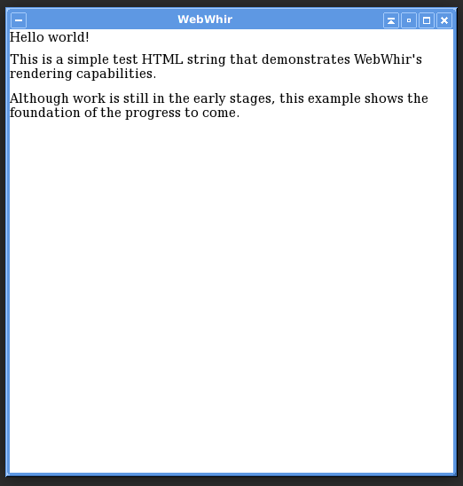

# WebWhir

Welcome to WebWhir!

## Project Overview

WebWhir is designed to become a simple HTML rendering engine (and, perhaps eventually, a fully-fledged web browser). That is, WebWhir will accept HTML files and turn them into rendered "web" pages.

You may very well be wondering just *why* another rendering engine is necessary (on top of Gecko, EdgeHTML, Trident, Presto, Blink, WebKit, Servo, and others). The short answer is that WebWhir is not necessary--rendering engines are simply a personal fascination of mine, and I wanted to write one.

On the other hand, WebWhir is designed to be very easy to link into any application, so it should be possible to eventually use WebWhir as a library to render HTML in a general purpose OpenGL program, which could serve some use.

## Building

After cloning this repository, follow a standard CMake build process.

```
mkdir build
cd build
cmake ..
make
```

### Dependencies

WebWhir uses [Boost](http://www.boost.org) sparingly and [SFML](https://www.sfml-dev.org) for graphics. 

## Demo

WebWhir renders the following HTML as shown in the image below.

```
<!DOCTYPE html>
<html>
    <head>
    </head>
    <body>
        <p>Hello world!</p>
        <p>This is a simple test HTML string that demonstrates WebWhir's rendering capabilities.</p>
        <p>Although work is still in the early stages, this example shows the foundation of the progress to come.</p>
    </body>
</html>
```



## Project History

I began working on WebWhir in early 2013. Although the early versions of WebWhir were able to render basic HTML documents, for most of the time since then, development has been stagnant. Furthermore, when I first began the project, I was in high school, and had no real sense of how to design a large program such as an HTML rendering engine. 

Therefore, with several more years of experience, I am beginning a complete rewrite of WebWhir, which is what you will find on the `master` branch. Of course, if you are interested in seeing the legacy versions of WebWhir, the `0.1.0` and `0.2.0` tags and releases are still accessible.

## Rewrite Roadmap

The philosophy of the rewrite is to get the necessary skeletal structure into place to demonstrate how other cases will be handled. For example, in the [HTML tokenizer](src/HTMLParser/HTMLTokenizer.cpp), there are well over 30 possible states that the tokenizer state machine can enter (as defined in the [specification](https://www.w3.org/TR/2011/WD-html5-20110113/parsing.html)). The current implementation of the tokenizer only handles the few of these that were necessary to parse simple and well-formatted strings. This choice was made to allow development of as many pieces of the final program as quickly as possible, rather than spending significant amounts of time handling countless edge cases. Of course, as time goes on, more and more of these edge cases will be implemented.

In this sense, the foundation of WebWhir is in place. Now, work will shift to implementing more and more features.

## Contributing

Additional contributors would be appreciated! Please see the [contributing guide](CONTRIBUTING.md) for more information.
